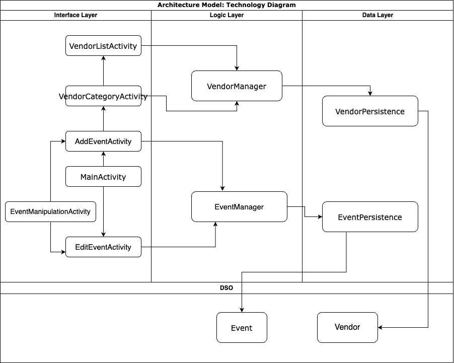

# Architecture Model 

## Iteration 1 Diagram

## Architecture Overview

Our projects' architecture was designed to resemble a three-tier architecture with an interface layer, a logic layer and a storage layer. Our interface layer is represented by the presentation folder. It is also our largest directory. In this folder we have three important files, MainActivity.java, AddEventActivity.Java EditEventActivity.Java. AddEventActivity allows the user to add and event along with various details about the event, including time, date and location. EditEventActivity.Java brings up the details of previously added events to change the details or delete the event entirely. MainActivity is the primary screen that the user interacts with. It displays a list of all the events the user has added. It also allows the users to select previous events in order to change them. We also have displayEvent that shows the details of an event. Our storage layer is represented by two directories, the objects and the persistence folder. In the objects folder we have Event.Java, This stores all the details related to an event. These include date, time, name, description, etc. In the persistence folder, we have EventPersistence.Java, which stores all the events that a user adds. Finally, we have our aptly named logic folder, which represents the logic layer. In this directory we have the extremely important EventManager.java file. This handles communication between the interface and storage layers. It removes, adds and changes events in the persistence folder and sends the data from those events to the interface for display. It will also sort the list of events based to the date and the time added.

