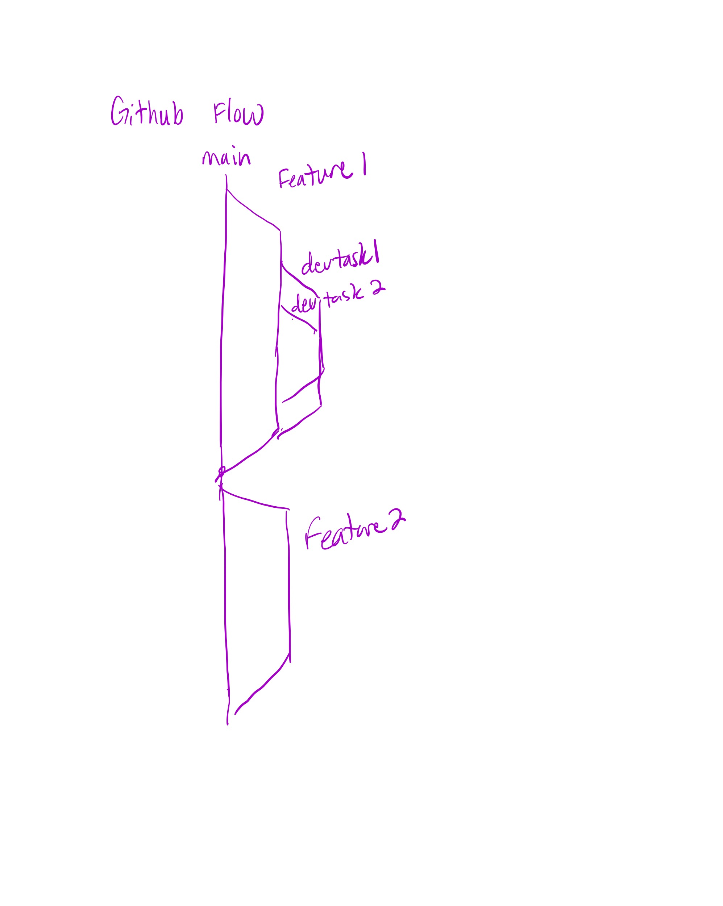
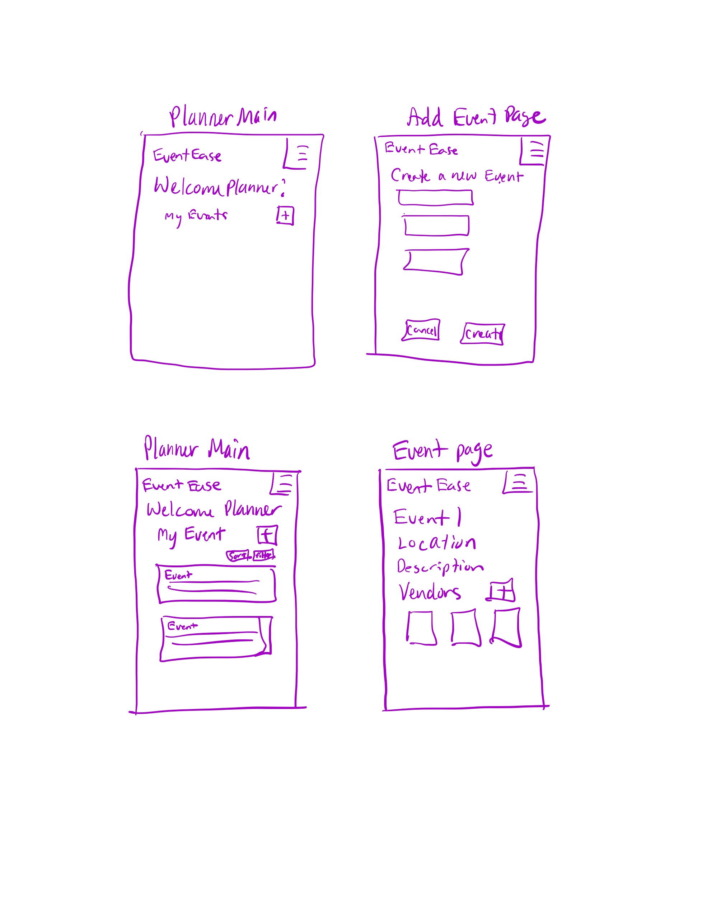
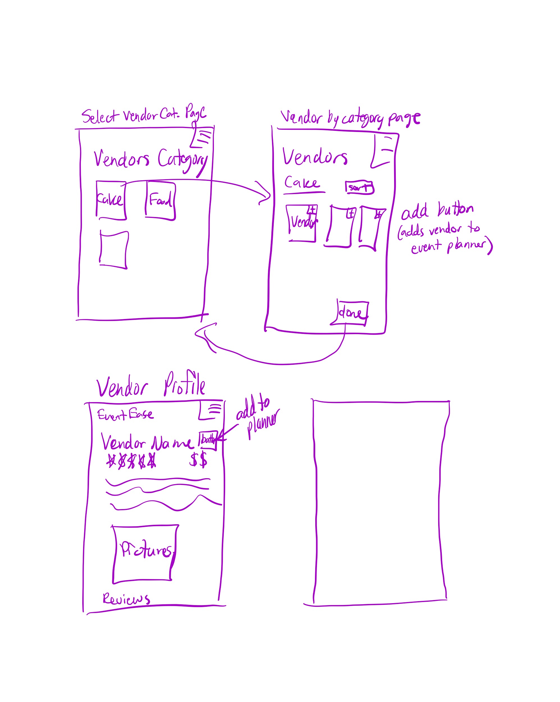

# Jan 29 Meeting Minutes

## Branch Workflow

Github flow

Create a branch off of main for each feature. 

For each dev task, create a branch off of that feature's branch. 

## Architecture Objects

Classes: 
- Event
- EventList
- EventManager
- Vendor
- VendorList
- VendorManager
- Request
- Invoice
- Task 
- Guest
- GuestList
- User
- Planner

## Assigning Tasks

Only assign yourself to a task when you will immediately be working on it. 

Grab unassigned tasks as we go. Communicate in Discord which feature is being worked on. 

Work on features in the order: 
- Create/edit/delete events 
- Source vendors 
- Sort events

## Unit Tests

Each member is responsible for creating the unit tests for the dev tasks they claim or are assigned to. 

Some discussed tests for create event might be: 
- checking for overlapping event dates
- valid input
- mandatory fields for title and date in form

## Initial Page Layouts

## Changes made to User Stories

Find vendors for event -> Find vendors for category

Filter vendor options by criteria -> sort vendor options by criteria

Move vendors respond to requests to Iteration 2 ** needs to be moved

## Code Style

- Write neat and simple functions
- Use clear function and variable names written in camelCase
- Use brackets in their own line 
