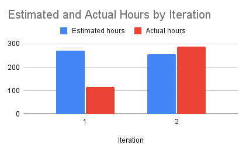

# Retrospection of Iteration 2

## Group Feedback and Actions

### Group Positives
- Communicated well
- We had less issues with merging  
- We finished what was required
- Meetings were more productive

### Group Areas of Improvement
- Not all the planned features were worked on 
- Imbalance in group contributions
- Progress was slow 
- Things were left to last minute

### Group Solutions
- Set more frequent personal and group deadlines 
- Try not to leave things to the last minute (start early)
- Try doing code reviews during our weekly meetings to encourage progress to be made and to check that the progress is following the plan for the features
- Follow the plan and break it down into more doable tasks

## Project Reflections
The changes we made for iteration 2 seemed to work well for us. Having the development branch to merge all our progress made merging easier and was more forgiving then merging to main and releasing from the files in main. 

Paired programming was good for having someone to ask questions that is familiar with the task at hand. However, this was a bit counter-productive when the members were working synchronously on the same branch. Regardless, we will continue with the same pairs for iteration 3 and avoid task conflicts by working on different branches and communicating when and what we are working on. 

An area we weren’t successful with in iteration 2 was completing all the features we had planned to finish. The “Source vendors for the various aspects of the event” feature was a big feature that we had planned to finish in iteration 1 and its priority was lowered to allow for more functionality of the planner user features. 

Since multiple features were moved to iteration 3, we have more realistic expectations for the amount of work we can accomplish. Our main priority for iteration 3 is to have our “Source vendors for the various aspects of the event” feature finished to allow our event planning concept to be more clearly applied. Since we pushed multiple features from iteration 2 to iteration 3, we are pushing the lower priority features to future milestones.

Another way we will keep track of our progress and motivate ourselves to finish our work with time to spare before the deadline, is to set task goals for the week and review code and progress at our weekly meetings. We can measure success of these goals and adjust as needed to better track our progress. 

## Project Velocity

In the chart above that compares the estimated and actual hours spent on iteration 1 and 2, you see in iteration 1 that we overestimated the number of hours needed to complete the submitted features. We more accurately estimated hours for Iteration 2 after reflecting on the estimates and learning how fast team members complete tasks. In iteration 3 we can continue to make, and adjust, appropriate estimates for features. 
 